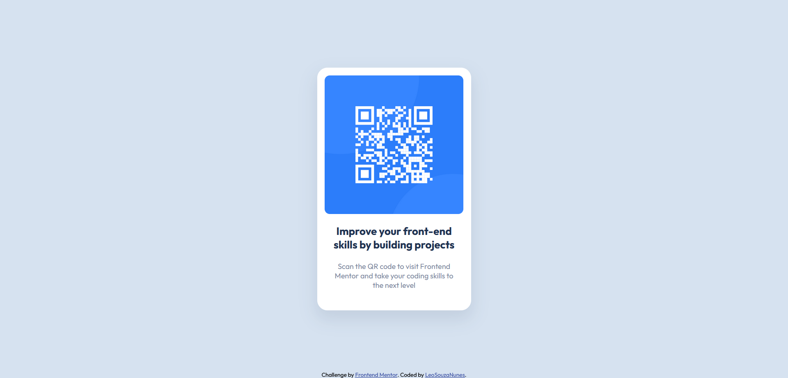

# Frontend Mentor - QR code component solution

This is a solution to the [QR code component challenge on Frontend Mentor](https://www.frontendmentor.io/challenges/qr-code-component-iux_sIO_H). Frontend Mentor challenges help you improve your coding skills by building realistic projects. 

## Table of contents

- [Overview](#overview)
  - [Screenshot](#screenshot)
  - [Links](#links)
- [My process](#my-process)
  - [Built with](#built-with)
  - [What I learned](#what-i-learned)
  - [Continued development](#continued-development)
  - [Useful resources](#useful-resources)
  - [Author](#author)
  - [Acknowledgments](#acknowledgments)

**Note: Delete this note and update the table of contents based on what sections you keep.**

## Overview

### Screenshot

### Links

- Solution URL: [Add solution URL here](https://your-solution-url.com)
- Live Site URL: [Add live site URL here](https://your-live-site-url.com)

## My process

### Built with

- Semantic HTML5 markup
- Flexbox

### What I learned

I was able to use HTML semantic tags.

### Continued development

As a future feature some hover states could be introduced, giving a better user experience.

### Useful resources

- [W3schools](https://www.w3schools.com/cssref/css3_pr_box-shadow.asp) - This resource helped me with the border.

## Author

- Frontend Mentor - [@LeoSouzaNunes](https://www.frontendmentor.io/profile/LeoSouzaNunes)
- Github - [@LeoSouzaNunes](https://github.com/LeoSouzaNunes)

## Acknowledgments

- [Github](https://github.com/Vinicios-Pires)
